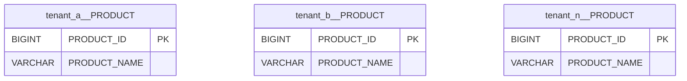

# POC: Multi-tenancy Separate Schemas

It demonstrates how to implement a multi-tenant REST API that persists data in different schemas.

The goal is to develop a REST API capable of persist and retrieve a product catalog. Each product must have a name and a
unique ID generated automatically by a database sequence that is going to be assigned to the product when the client
requests a new product to be created.

The application should be able to switch among different schemas from a single data source based on the client sending
the request to create or find products based on an HTTP header, therefore not mixing products from different clients
by using single database instance but different schemas. An error should be returned to clients requesting data
without informing a known tenant.

All tenant configuration should be defined outside the application source code using property files, and we must be able
to add or remove tenants without changing the source code.

The Web service is implemented using Spring MVC, data is persisted on Postgres databases managed by Flyway using
Spring Data JPA. The source code is managed by JUnit with databases provisioned in containers managed by TestContainers
and no manual configuration is required to run automated tests.

Other approaches to multi-tenancy
are [Separate Databases](https://github.com/lucasvalenteds/poc-multi-tenancy-separate-databases)
and [Shared Schemas](https://github.com/lucasvalenteds/poc-multi-tenancy-shared-schemas).

## How to run

| Description                    | Command                                             |
|:-------------------------------|:----------------------------------------------------|
| Run tests                      | `./gradlew test`                                    |
| Run application                | `./gradlew bootRun`                                 |
| Provision database¹            | `docker-compose up --detach`                        |
| Destroy database¹              | `docker-compose down --volumes`                     |

> ¹Required for manual testing only, automated tests provision and destroy a database automatically. Must run
> inside `infrastructure` folder.

## Preview

Overview of this multi-tenant approach:

```mermaid
flowchart TB
api[Product API]
database[(DataSource)]

tenant_a((Tenant A))
tenant_b((Tenant B))
tenant_n((Tenant N))

tenant_a -- GET /products\nX-Tenant-Id: tenant-a --> api
tenant_b -- GET /products\nX-Tenant-Id: tenant-b --> api
tenant_n -. GET /products\nX-Tenant-Id: tenant-n -.-> api

api -- tenant_a.PRODUCT --> database
api -- tenant_b.PRODUCT --> database
api -. tenant_n.PRODUCT -.-> database
```

Database structure for the DataSource:



> Symbol `__` means `.`, so `public__PRODUCT` means `public.PRODUCT`.

Logging statements from application startup during automated tests:

```text
2022-07-30T11:28:19.147-03:00  INFO 35159 --- [    Test worker] com.example.ApplicationTest              : Starting ApplicationTest using Java 18.0.2 on pc with PID 35159
2022-07-30T11:28:19.147-03:00 DEBUG 35159 --- [    Test worker] com.example.ApplicationTest              : Running with Spring Boot v3.0.0-M4, Spring v6.0.0-M5
2022-07-30T11:28:19.147-03:00  INFO 35159 --- [    Test worker] com.example.ApplicationTest              : No active profile set, falling back to 1 default profile: "default"
2022-07-30T11:28:20.524-03:00 DEBUG 35159 --- [    Test worker] enantsConfiguration$TenantSchemaSelector : Resolving tenant identifier (tenant=public)
2022-07-30T11:28:20.544-03:00 DEBUG 35159 --- [    Test worker] enantsConfiguration$TenantSchemaSelector : Resolving tenant identifier (tenant=public)
2022-07-30T11:28:20.568-03:00 DEBUG 35159 --- [    Test worker] enantsConfiguration$TenantSchemaSelector : Resolving tenant identifier (tenant=public)
2022-07-30T11:28:20.828-03:00  INFO 35159 --- [    Test worker] c.e.internal.TenantsDatabaseInitializer  : Migrating tenant schema (schema=company_x)
2022-07-30T11:28:20.904-03:00  INFO 35159 --- [    Test worker] c.e.internal.TenantsDatabaseInitializer  : Tenant schema migrated successfully (schema=company_x, success=true)
2022-07-30T11:28:20.905-03:00  INFO 35159 --- [    Test worker] c.e.internal.TenantsDatabaseInitializer  : Migrating tenant schema (schema=company_y)
2022-07-30T11:28:20.922-03:00  INFO 35159 --- [    Test worker] c.e.internal.TenantsDatabaseInitializer  : Tenant schema migrated successfully (schema=company_y, success=true)
2022-07-30T11:28:20.923-03:00  INFO 35159 --- [    Test worker] com.example.ApplicationTest              : Started ApplicationTest in 1.915 seconds (process running for 4.305)
2022-07-30T11:28:21.274-03:00 DEBUG 35159 --- [o-auto-1-exec-1] com.example.internal.TenantInterceptor   : Handling request for tenant company_x
2022-07-30T11:28:21.275-03:00 DEBUG 35159 --- [o-auto-1-exec-1] enantsConfiguration$TenantSchemaSelector : Resolving tenant identifier (tenant=company_x)
2022-07-30T11:28:21.316-03:00  INFO 35159 --- [o-auto-1-exec-1] c.example.product.api.ProductController  : Creating new product (request=ProductRequest(name=A4 Paper))
2022-07-30T11:28:21.329-03:00 DEBUG 35159 --- [o-auto-1-exec-1] tsConfiguration$TenantConnectionProvider : Getting connection for a tenant (tenantIdentifier=company_x)
2022-07-30T11:28:21.362-03:00  INFO 35159 --- [o-auto-1-exec-1] c.example.product.api.ProductController  : New product created (product=Product(id=1, name=A4 Paper))
2022-07-30T11:28:21.372-03:00 DEBUG 35159 --- [o-auto-1-exec-1] com.example.internal.TenantInterceptor   : Removed tenant assigned previously before sending response to client
2022-07-30T11:28:21.372-03:00 DEBUG 35159 --- [o-auto-1-exec-1] tsConfiguration$TenantConnectionProvider : Releasing connection for a tenant (tenantIdentifier=company_x)
2022-07-30T11:28:21.395-03:00 DEBUG 35159 --- [o-auto-1-exec-2] com.example.internal.TenantInterceptor   : Handling request for tenant company_x
2022-07-30T11:28:21.396-03:00 DEBUG 35159 --- [o-auto-1-exec-2] enantsConfiguration$TenantSchemaSelector : Resolving tenant identifier (tenant=company_x)
2022-07-30T11:28:21.397-03:00  INFO 35159 --- [o-auto-1-exec-2] c.example.product.api.ProductController  : Creating new product (request=ProductRequest(name=Pencil 1B))
2022-07-30T11:28:21.397-03:00 DEBUG 35159 --- [o-auto-1-exec-2] tsConfiguration$TenantConnectionProvider : Getting connection for a tenant (tenantIdentifier=company_x)
2022-07-30T11:28:21.399-03:00  INFO 35159 --- [o-auto-1-exec-2] c.example.product.api.ProductController  : New product created (product=Product(id=2, name=Pencil 1B))
2022-07-30T11:28:21.400-03:00 DEBUG 35159 --- [o-auto-1-exec-2] com.example.internal.TenantInterceptor   : Removed tenant assigned previously before sending response to client
2022-07-30T11:28:21.400-03:00 DEBUG 35159 --- [o-auto-1-exec-2] tsConfiguration$TenantConnectionProvider : Releasing connection for a tenant (tenantIdentifier=company_x)
2022-07-30T11:28:21.414-03:00 DEBUG 35159 --- [o-auto-1-exec-3] com.example.internal.TenantInterceptor   : Handling request for tenant company_y
2022-07-30T11:28:21.415-03:00 DEBUG 35159 --- [o-auto-1-exec-3] enantsConfiguration$TenantSchemaSelector : Resolving tenant identifier (tenant=company_y)
2022-07-30T11:28:21.416-03:00  INFO 35159 --- [o-auto-1-exec-3] c.example.product.api.ProductController  : Creating new product (request=ProductRequest(name=Eraser))
2022-07-30T11:28:21.416-03:00 DEBUG 35159 --- [o-auto-1-exec-3] tsConfiguration$TenantConnectionProvider : Getting connection for a tenant (tenantIdentifier=company_y)
2022-07-30T11:28:21.418-03:00  INFO 35159 --- [o-auto-1-exec-3] c.example.product.api.ProductController  : New product created (product=Product(id=1, name=Eraser))
2022-07-30T11:28:21.418-03:00 DEBUG 35159 --- [o-auto-1-exec-3] com.example.internal.TenantInterceptor   : Removed tenant assigned previously before sending response to client
2022-07-30T11:28:21.419-03:00 DEBUG 35159 --- [o-auto-1-exec-3] tsConfiguration$TenantConnectionProvider : Releasing connection for a tenant (tenantIdentifier=company_y)
2022-07-30T11:28:21.425-03:00 DEBUG 35159 --- [o-auto-1-exec-4] com.example.internal.TenantInterceptor   : Handling request for tenant company_x
2022-07-30T11:28:21.425-03:00 DEBUG 35159 --- [o-auto-1-exec-4] enantsConfiguration$TenantSchemaSelector : Resolving tenant identifier (tenant=company_x)
2022-07-30T11:28:21.425-03:00  INFO 35159 --- [o-auto-1-exec-4] c.example.product.api.ProductController  : Finding all existing products
2022-07-30T11:28:21.426-03:00 DEBUG 35159 --- [o-auto-1-exec-4] tsConfiguration$TenantConnectionProvider : Getting connection for a tenant (tenantIdentifier=company_x)
2022-07-30T11:28:21.496-03:00  INFO 35159 --- [o-auto-1-exec-4] c.example.product.api.ProductController  : Returning all products found (products=ProductsResponse(products=[ProductResponse(id=1, name=A4 Paper), ProductResponse(id=2, name=Pencil 1B)]))
2022-07-30T11:28:21.503-03:00 DEBUG 35159 --- [o-auto-1-exec-4] com.example.internal.TenantInterceptor   : Removed tenant assigned previously before sending response to client
2022-07-30T11:28:21.503-03:00 DEBUG 35159 --- [o-auto-1-exec-4] tsConfiguration$TenantConnectionProvider : Releasing connection for a tenant (tenantIdentifier=company_x)
2022-07-30T11:28:21.533-03:00 DEBUG 35159 --- [o-auto-1-exec-5] com.example.internal.TenantInterceptor   : Handling request for tenant company_y
2022-07-30T11:28:21.533-03:00 DEBUG 35159 --- [o-auto-1-exec-5] enantsConfiguration$TenantSchemaSelector : Resolving tenant identifier (tenant=company_y)
2022-07-30T11:28:21.533-03:00  INFO 35159 --- [o-auto-1-exec-5] c.example.product.api.ProductController  : Finding all existing products
2022-07-30T11:28:21.533-03:00 DEBUG 35159 --- [o-auto-1-exec-5] tsConfiguration$TenantConnectionProvider : Getting connection for a tenant (tenantIdentifier=company_y)
2022-07-30T11:28:21.536-03:00  INFO 35159 --- [o-auto-1-exec-5] c.example.product.api.ProductController  : Returning all products found (products=ProductsResponse(products=[ProductResponse(id=1, name=Eraser)]))
2022-07-30T11:28:21.537-03:00 DEBUG 35159 --- [o-auto-1-exec-5] com.example.internal.TenantInterceptor   : Removed tenant assigned previously before sending response to client
2022-07-30T11:28:21.537-03:00 DEBUG 35159 --- [o-auto-1-exec-5] tsConfiguration$TenantConnectionProvider : Releasing connection for a tenant (tenantIdentifier=company_y)
```